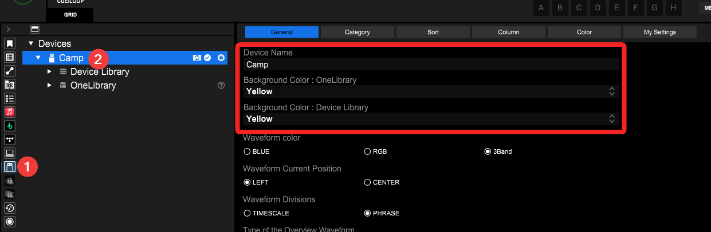

Hiya! 👋

Welcome to my guide on getting prepared to use standalone Rekordbox hardware (CDJs, XDJs and whatnot) on stage. ✨

I'm an IT professionnal by day who did a lot of AV and DJ work over the past 10+ years.
I've seen a lot of DJays panick on stage because their USB key didn't work or the settings applied to the players were not working for them. 🫠

So, this page aims at helping you to not end up in a similar situation and that gives me the occasion to point out a few things you may easily overlook.
Hopefully you'll find something helpful in there. ❤️‍🩹

> By the way, I'm publishing my mixtapes in [a podcast][castopod-listen] and I also have [some demos available to listen][castopod-demos] if you're interested! 🎶

This guide is structured in two main parts:

1. [USB keys](#usb-keys)
2. [Rekordbox app and settings](#rekordbox-app-and-settings)

Of course, feel free to check the table of contents to jump at the spot you're the most interested in. 🔍

## USB keys

### USB key performance

First, I noticed there's a few things that can happen when DJing off an underperforming USB key and these have had real impact on DJays playing on stage at events I was involved in.

- <mark>📩 Slow export / transfer speeds with Rekordbox</mark> 
  Frustrating when you just wanna add "that new track that just came out" right before leaving for your set!
- <mark>🔍 Slow library searching / browsing speeds on decks</mark> 
  Also anxiety inducing when you get an idea and need to find the track quick!
- <mark>📤 Slow track loading speeds on decks</mark> 
  Especially relevant when loading and moving in your next track pretty late before your next transition!
- <mark>🥶 Playback freezes on decks</mark> 
  Less common but it can happen when the USB key can't keep up with the player running through the song.
- <mark>☠️ Corrupted / incomplete recordings on standalone systems</mark> 
  While the recording feature is reserved to all-in-one units, it's still heart wrenching when your sick set's recording doesn't work.

So...now that you understand the importance of your "cheap" USB keys to run reliably, let's look at what to look for to prevent these issues. 😉

#### How to shop for a USB key

It's actually pretty easy as it turns out! Here's the few specs you wanna keep in check for your next purchase.

- <mark>✏️ 4K random write speeds</mark> 
  This has an impact on exporting your library from Rekordbox on desktop to your USB key and even set recording to some extent.
- <mark>🔍 4K random read speeds</mark> 
  This helps when searching and browsing your library on players as it's a lot of random small data reads in device libraries.
- <mark>🎞️ Sequential read speeds</mark> 
  While this one is usually fine, it does improve your tracks' loading speeds as seen by the waveforms gradually appearing on screen _in sequence_.
- <mark>🏬 Local shops</mark> 
  It doesn't affect performance, but the ability to get a new drive from a local shop in emergency hours before playing is heavily underestimated. It also helps protecting against counterfeits sold online.

#### What I'm using

To date, I'm using a [Kingston's DataTraveler Max][kingston-datatravelermax].
It has decent enough specs for relieving my own anxiety and my friends' during Rekordbox exports. It's also available at the most present computer stores in my area ([Canada Computers][kingston-datatravelermax-canadacomputers] and [Best Buy][kingston-datatravelermax-bestbuy]), which already has been handy in a few occasions. ❤️‍🩹

So, assuming you've got a nice USB key now...How about checking its formatting? 👀

### USB key formatting

This part is **much simpler** to talk about as there's pretty much only one detail that will change depending on your use case.

When you'll load up Disk Manager on your computer, make sure that your USB disk is using:

- <mark>📜 MBR partitioning scheme</mark> 
  It seems like even some recent DJ hardware are still incompatible with GPT-based drives. So, stick with MBR for now.
- <mark>💽 FAT32 partition format</mark> **if you're playing on old hardware** _(up to CDJ-2000NXS2 players)_ **or will be using this drive to update players and mixers' firmwares** 
  While this usually won't cause issues on recent hardware, it's preferred to avoid FAT32 if you're going to record extended DJ sets on that USB key.
- <mark>💽 exFAT partition format</mark> is preferred otherwise but optional if playing on recent hardware _(CDJ-3000 and XDJ-XZ and up)_ 
  This partition format is [better suited for flash memory][^1] and can handle bigger files which is handy for recording your sick DJ sets.

[^1]: "ExFAT was made to be very portable and optimized for flash drives. It’s lightweight like FAT32, but without the same file size restrictions." — [John Bogna @ PCMag Labo][pcmag-storage-formats]

## Rekordbox app and settings

### USB key identification

First, I really want to point this out since this is overlooked very often.
You can label your USB keys on Rekordbox and that label shows up on players and Rekordbox itself! ✨

Just open the properties of your USB key while in Export mode and then you'll see all of it there! 🎉

As you can see, I set mine with my name and I set it as yellow. But there's height colours to choose from. 💛

Now's the time to turn your attention to your settings because that's another anxiety reliever that a lot of people are missing on.

### USB DJ settings

You likely noticed that there are a few more settings presented to you right under those name and colour settings.
Notably, the waveform colour, position and divisions, the songs' key display format and, probably my favourite, a picture that you can display on your jog wheels.
I very much use this to put some funny memes there. Kind of a easter egg for people hanging out or taking pictures in the booth. 👀

However, please also take a look at the other tabs.
They contain a lot of settings you're likely gonna want to setup also.

- <mark>General</mark> 
  You probably know that one by heart now but this has all the essentials to at least get started.
- <mark>Category</mark> 
  That's where you set the "views" you want available on the players. You really need to set this beforehand otherwise you likely won't be able to get them back once on stage. 😅
- <mark>Sort</mark> 
  Less crucial of a setting to set but, again, getting new ones shown _on device_ is a bit hard. Set this in advance.
- <mark>Column</mark> 
  This allows you to select the information you want displayed when browsing tracks. I personnally set it to rating as I use that as a way to gauge the energy of tracks.
- <mark>Color</mark> 
  Just make sure that your Colour tags are set to the same names you have in Rekordbox' application preferences. Otherwise you may not remember what they mean on stage. 😅
- <mark>My Settings</mark> 
  As you can see, nothing can be changed there. That's because it is reflecting your Rekordbox applications' DJ Settings preferences. And of course they don't give you a button to access them quickly. 🫠

{{< carousel images="{attachments/rekordbox-usb-general.webp,attachments/rekordbox-usb-category.webp,attachments/rekordbox-usb-sort.webp,attachments/rekordbox-usb-column.webp,attachments/rekordbox-usb-color.webp,attachments/rekordbox-usb-mysettings.webp}" >}}

<!-- 
{style="width:50%;"}

{style="width:50%;"} -->

There's also more tabs to click through at the top with even more settings.
These are all of your DJ settings you will be able to recall on the players and mixers when you'll hop on stage for your set.
Please take the time to go through them and configure them to your liking. 😇

A lot of DJays I supported during shows were understandably anxious when they found out that the players were not behaving to their liking because they were running off the previous DJ's settings. 🫠

## Device libraries

[castopod-listen]: https://music.jackle.ca/@listen/episodes "Listen with Camp on Camp's Castopod instance"
[castopod-demos]: https://music.jackle.ca/@promo/episodes "Camp's demos on Camp's Castopod instance"
[kingston-datatravelermax]: https://www.kingston.com/en/usb-flash-drives/datatraveler-max "Kingston DataTraveler Max USB 3.2 Gen 2 flash drive on Kingston's official website"
[kingston-datatravelermax-canadacomputers]: https://www.canadacomputers.com/en/flash-drives/244849/kingston-datatraveler-max-256gb-usb-a-3-2-gen-2-flash-drive-dtmaxa-256gb.html "Kingston Kingston DataTraveler Max in 256 GB USB-A variant on Canada Computers"
[kingston-datatravelermax-bestbuy]: https://www.bestbuy.ca/en-ca/product/17039346 "Kingston Kingston DataTraveler Max in 256 GB USB-A variant on Best Buy Canada"
[pcmag-storage-formats]: https://www.pcmag.com/how-to/fat32-vs-exfat-vs-ntfs-which-format-is-best-for-your-storage-drive#exfat-lightweight-compatible-high-capacity:~:text=ExFAT%20was%20made%20to%20be%20very%20portable%20and%20optimized%20for%20flash%20drives%2E%20It%E2%80%99s%20lightweight%20like%20FAT32%2C%20but%20without%20the%20same%20file%20size%20restrictions%2E "PCMag Labo:  FAT32 vs. ExFAT vs. NTFS: Which Format Is Best for Your Storage Drive?"
